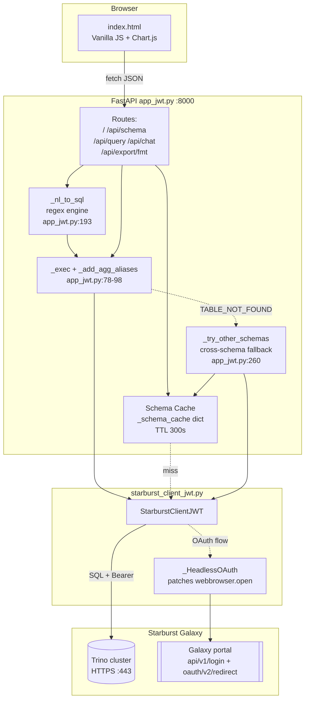
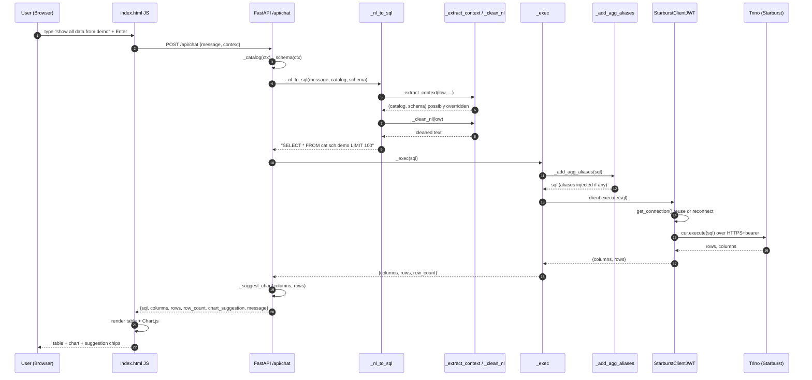
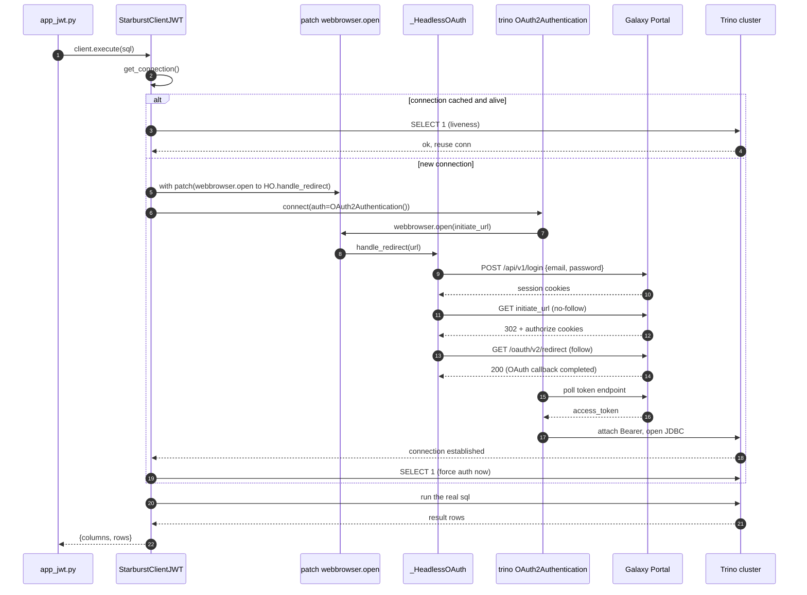
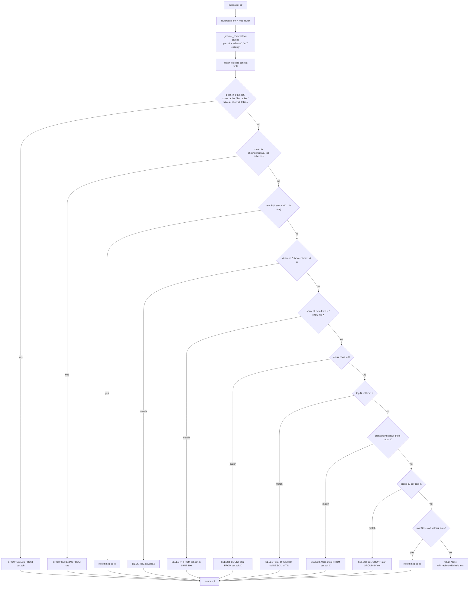
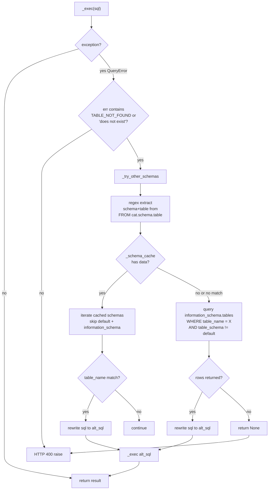
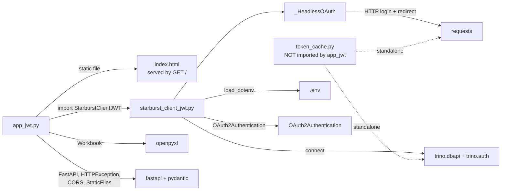

# `app_jwt.py` — Flow Documentation

## 1. Executive Summary

`app_jwt.py` is the **FastAPI backend** for StarQuery AI — a browser-based chatbot that converts natural-language prompts into Trino/SQL against **Starburst Galaxy** and renders results as tables, charts, and exports. The "JWT" suffix denotes the **headless-OAuth2** variant: no interactive browser popup, because `webbrowser.open` is monkey-patched to complete the Galaxy OAuth flow programmatically (see [`starburst_client_jwt.py`](../gen%20ai%20project/starburst-mcp2/starburst_client_jwt.py)).

Audience: backend engineers extending the chatbot, adding tools, swapping the NL engine, or hardening for production.

Related docs: [`README.md`](../README.md), [`STARBURST-AUTH.md`](../gen%20ai%20project/starburst-mcp2/STARBURST-AUTH.md).

---

## 2. Technology Stack

| Layer | Technology | Version / Spec | Purpose | Why chosen |
|---|---|---|---|---|
| Frontend markup | HTML5 single file (`index.html`) | — | UI, schema browser, chat, chart panel | Zero build step; ships with backend |
| Frontend CSS | Inline CSS (dark/light) | — | Themed single-page UI | Keeps the app portable — one file, no bundler |
| Frontend JS | Vanilla JS (no framework) | ES2020+ | Fetch calls, DOM updates, exports | Avoids React/Vue toolchain for a demo-scale UI |
| Charting | Chart.js | CDN-loaded | Bar / pie / line / area | De-facto lightweight chart lib, no build |
| Frontend export | `html2canvas` + `jsPDF` | CDN | PDF/JPEG screenshot export | Client-side rendering — no server load |
| Web framework | FastAPI | latest | ASGI app, routing, DI, Pydantic models | Async-first, typed, auto OpenAPI |
| ASGI server | Uvicorn | `uvicorn[standard]` | Hosts FastAPI on `:8000` | Canonical pair with FastAPI |
| Validation | Pydantic v2 | bundled with FastAPI | `QueryRequest`, `ChatRequest`, `ExportRequest` at [`app_jwt.py:47-57`](../gen%20ai%20project/starburst-mcp2/app_jwt.py#L47-L57) | Declarative request validation |
| Concurrency | `threading`, `concurrent.futures.ThreadPoolExecutor` | stdlib | Parallel `SHOW TABLES` + `DESCRIBE` fan-out in `_fetch_schema` [`app_jwt.py:325-367`](../gen%20ai%20project/starburst-mcp2/app_jwt.py#L325-L367) | Trino calls are I/O-bound; threads avoid GIL pain |
| DB client | `trino` DBAPI | `>=0.328.0` | Cursor-based query execution | Official client |
| Database | Starburst Galaxy (Trino) | managed | Query federation + storage | Project target |
| Auth | OAuth2 (interactive flow, headless-patched) | `trino.auth.OAuth2Authentication` + monkeypatch | Bearer auth to Trino; login via Galaxy portal API | Avoids browser popup for servers/agents |
| Token cache | `token_cache.py` (standalone, **not imported by `app_jwt.py`**) | JSON on disk | Persist token across restarts | Cold-start latency reduction |
| Excel export | `openpyxl` | `>=3.1` | `.xlsx` writer | Pure-Python, no native deps |
| HTML export | stdlib string templating | — | Printable table | No deps |
| Config | `python-dotenv` | `>=1.0` | `.env` loader | 12-factor config |
| Permissions (MCP side) | PyYAML via `permission_manager.py` | — | Per-developer RBAC | Not used by `app_jwt.py` itself (MCP-only) |
| Tests | `pytest` | `>=8.0` | 14 unit + 6 integration | Standard |
| Ops | `keepalive.py` daemon, Codespaces `.devcontainer/` | — | Prevent Galaxy free-cluster cold start | Free tier idle-sleeps after ~5 min |

---

## 3. High-Level Architecture

---

## 4. Request Lifecycle — `POST /api/chat`

---

## 5. Authentication Flow (headless OAuth2)

`app_jwt.py` imports `StarburstClientJWT` ([`starburst_client_jwt.py:60`](../gen%20ai%20project/starburst-mcp2/starburst_client_jwt.py#L60)). The trick: `trino.auth.OAuth2Authentication` calls `webbrowser.open(url)` when it needs user consent; `StarburstClientJWT.get_connection()` uses `unittest.mock.patch` to redirect that call into `_HeadlessOAuth.handle_redirect`, which replays the Galaxy login via HTTP.

**Note on `token_cache.py`.** It is a **separate** entry point that persists the token metadata to `token_cache.json` for restart reuse. It is **not** imported by `app_jwt.py`; it exists for standalone scripts and future consolidation.

---

## 6. NL to SQL Decision Flow (`_nl_to_sql`)

Source: [`app_jwt.py:193-256`](../gen%20ai%20project/starburst-mcp2/app_jwt.py#L193-L256).

---

## 7. Error and Fallback Flow

When the default schema does not contain the requested table, `_try_other_schemas` searches the **in-memory schema cache** first, then falls back to `information_schema.tables`. This avoids repeated slow Trino round-trips.

Source: [`app_jwt.py:260-295`](../gen%20ai%20project/starburst-mcp2/app_jwt.py#L260-L295) and the `/api/chat` error branch at [`app_jwt.py:417-429`](../gen%20ai%20project/starburst-mcp2/app_jwt.py#L417-L429).

---

## 8. Module Dependency Graph

---

## 9. Data / State Inventory

| Name | Location | Lifetime | Thread safety | Invalidation |
|---|---|---|---|---|
| `_schema_cache` | module-global dict in `app_jwt.py:310` | Process lifetime | Not locked; read/write are atomic dict ops; pre-warmed on startup in a daemon thread ([`app_jwt.py:513-520`](../gen%20ai%20project/starburst-mcp2/app_jwt.py#L513-L520)) | TTL 300 s or `/api/schema?refresh=1` |
| Trino connection | `StarburstClientJWT._conn` instance attr | Process lifetime, reused | **Not thread-safe.** FastAPI routes are async but the Trino cursor is sync; under concurrent requests a single shared cursor can corrupt results. See [Extension Points](#10-extension-points) | Reset to `None` on any `execute()` exception or `SELECT 1` liveness failure |
| OAuth token | Inside Trino `OAuth2Authentication` object | Matches connection lifetime | Managed by Trino client | Auto-refresh by Trino client when token nears expiry |
| Disk token cache | `token_cache.json` (only via `token_cache.py`, not `app_jwt.py`) | Cross-restart | Single writer | Checks `expires_at` with 60 s buffer; `save_token` rewrites |
| FastAPI `app` state | Module global | Process lifetime | Managed by FastAPI/Uvicorn workers | N/A |
| Static file mount `/static` | Conditional on `static/` folder existing at import ([`app_jwt.py:37-40`](../gen%20ai%20project/starburst-mcp2/app_jwt.py#L37-L40)) | Process lifetime | Read-only | N/A |
| Startup banner + cache warm | `@app.on_event("startup")` ([`app_jwt.py:503`](../gen%20ai%20project/starburst-mcp2/app_jwt.py#L503)) | Once per process | `threading.Thread(daemon=True)` | N/A |

---

## 10. Extension Points

- **LLM-backed NL to SQL.** Current engine is pure regex ([`_nl_to_sql`](../gen%20ai%20project/starburst-mcp2/app_jwt.py#L193)). Swap by injecting a function with signature `(message, catalog, schema) -> str | None` that calls an LLM with the schema cache as grounding context. Keep the regex path as a fast fallback.
- **Connection pooling / thread safety.** Replace the single shared `_conn` with a per-request connection or a bounded pool (`queue.Queue` of `StarburstClientJWT` instances) to avoid cursor contention under load.
- **New auth providers.** `StarburstClientJWT._get_auth` returns `OAuth2Authentication()`; parameterize to accept `BasicAuthentication`, true JWT bearer, or SAML, selected via `.env`.
- **New export formats.** Extend `/api/export/{fmt}` ([`app_jwt.py:442`](../gen%20ai%20project/starburst-mcp2/app_jwt.py#L442)) — add `parquet` via pyarrow, `json` trivially, or `markdown` for LLM hand-off.
- **Multi-tenant permissions.** Port `permission_manager.py` (currently MCP-only) into `app_jwt.py`: resolve developer from a header/JWT claim, gate `_exec` by permission flag.
- **Observability.** Add a FastAPI middleware to emit structured logs + Prometheus metrics (query count, latency, NL-match rate, TABLE_NOT_FOUND fallback rate).
- **Streaming results.** For large result sets, switch `/api/chat` to a WebSocket or SSE stream that yields rows as Trino delivers them.

---

## Deliverables Summary

1. **File written:** `docs/FLOW.md`
2. **Mermaid diagrams produced: 6** — architecture (`graph TB`), request lifecycle (`sequenceDiagram`), auth flow (`sequenceDiagram`), NL-to-SQL decision (`flowchart TD`), error fallback (`flowchart TD`), module dependency (`graph LR`).
3. **Deviations between optimized spec and actual code:**
   - **Auth is not OAuth2 client-credentials.** It is the standard **OAuth2 authorization-code flow** with `webbrowser.open` monkey-patched so `_HeadlessOAuth` replays the Galaxy portal login + redirect endpoint instead of opening a browser. Documented accurately in §5.
   - **`token_cache.py` is NOT wired into `app_jwt.py`.** The spec implied it was a direct collaborator; in reality it is a standalone script / CLI. Noted in §5 and §8.
   - **Latent bug at [`app_jwt.py:525`](../gen%20ai%20project/starburst-mcp2/app_jwt.py#L525):** `uvicorn.run("app:app", ...)` references module `app`, not `app_jwt`. Running `python app_jwt.py` directly loads the wrong module. Recommended fix: `uvicorn.run("app_jwt:app", ...)`, or launch via `python -m uvicorn app_jwt:app --port 8000` (as the README instructs).
   - **Schema cache is pre-warmed** on startup in a background daemon thread — worth calling out for operators (§9).
4. **Sensitive values masked:**
   - Galaxy tenant host (category: `<TENANT>.galaxy.starburst.io`) — abstracted in all diagrams/examples; real value only lives in `.env` (gitignored).
   - Email / password credentials — referenced as `email`, `password` parameters; never shown.
   - Catalog / schema names — shown as `cat.sch` / `<CAT>.<SCH>` placeholders in examples.
   - No real identifiers from `permissions.yaml` appear in this document.
